# Medicus

Medicus is a telemedicine website that aims to provide you with access to health care, anytime and anywhere. Your health and well-being is our top priority.

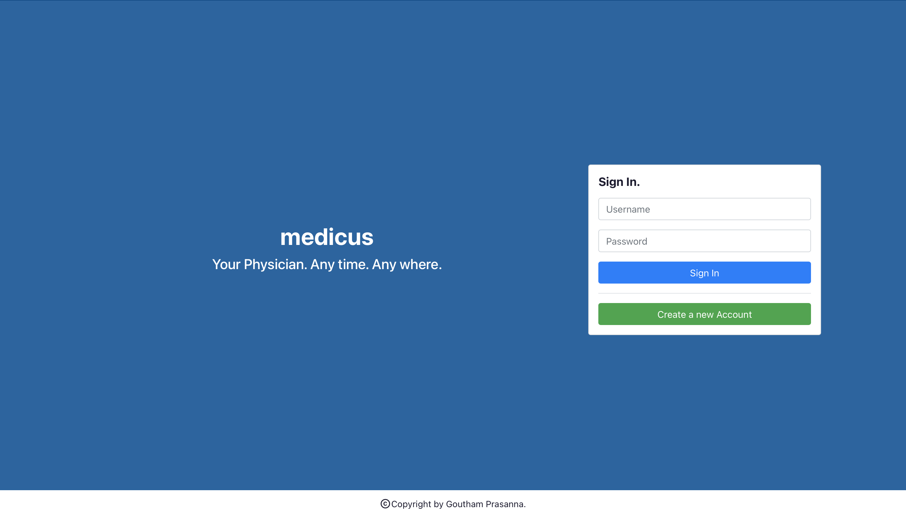


## Why Medicus?

We've experienced an unprecedented Covid-19 pandemic in the last two years (2020/21). This virus outbreak has affected our lives and restricted people-to-people interaction. Social distancing has become the new norm. All of this in current internet age begs one important question. How can we use technology and make it easy for people to contact a health care physician while staying at their home?

This website provides you with an easy access to find a physician and receive health advice from them. Connect with them by scheduling quick appointments. Discuss your concerns by chatting with them and get your regular health update.


## Visit my website?
This website is hosted on Heroku. You can visit it by clicking on below link. Don't forget to register as a new user? ;)

https://gp-medicus.herokuapp.com

**NOTE:** Please do not provide any personal information when visiting my website. Let's keep it simple and safe! :)


## Implementation Specifications
1. Client side is developed using **React framework** along with **Redux** and **React-router** javascript libraries.
2. Server side is developed using **Express.js framework** over **Node.js** back-end.
3. **MongoDB Atlas Cloud database**, is used at server side to store application data.
4. Website is deployed on **Heroku Cloud** platform.
5. **Bootstrap** is used as the base CSS framework at client side.


## Website Walk-through
A complete walk-through of my website is available at below youtube link-

https://www.youtube.com/watch?v=E0aSBCv3FTs&t=271s


## Website Layout
1. **Welcome** page: When you visit my website, you will be initially directed to the Welcome page. 
   1. If you already have an account, you can sign-in by providing your credentials in the Sign-In section. 
   2. If you are a new user, please click on "Create a new Account" to create an account for yourself. 
   3. You can choose to create your account as a **Patient** or as a **Physician**. Both user types will have their own perspective view of services provided by this website. 
   4. Once your account has been created, you will be automatically re-directed to your "Dashboard" page.

<p float="left">
   
   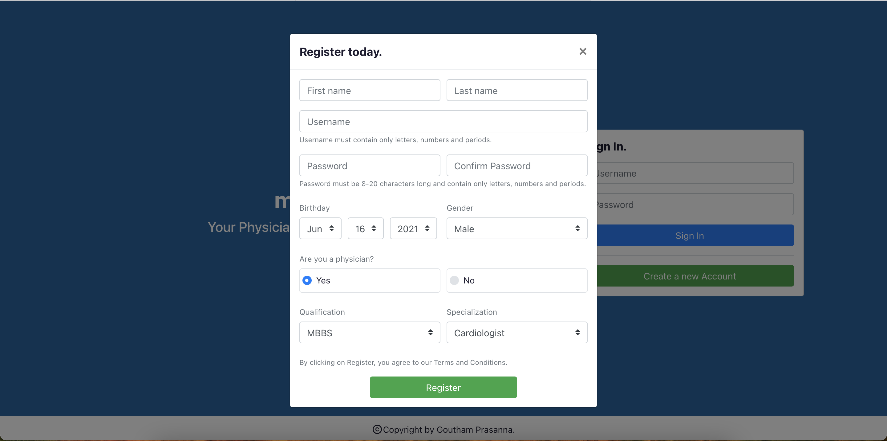 
</p>

2. **General Layout**: All pages, except Welcome page, are divided into left and right sections.
   1. Left section is a sidebar that includes important links. You can click on these links to navigate around the website.
   2. Right section shows information regarding each link.

3. **Dashboard** page: After signing in, you will be re-directed to this page. It is your one-stop to an overview for the current day. It quickly shows you any appointments that you're currently waiting on. Also, it shows your recent medication and payment history.

<p float="left">
   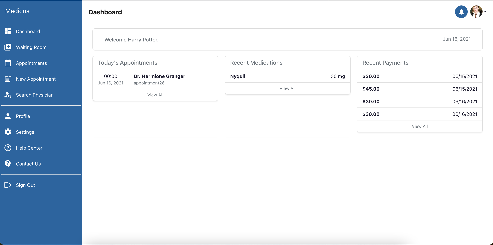
</p>

4. **New Appointment** page [Patients only]: On the left sidebar, click on "New Appointment" link. This will take you through three quick steps to create a new appointment. 
   1. First, search for a physician. Click on one of the suggestion provided based on your search.
   2. Second, select from one of the services provided by your physician.
   3. Third, provide few details about your appointment that will help your physician.
   4. Request for an appointment by clicking on "Request Appointment" button.

<p float="left">
   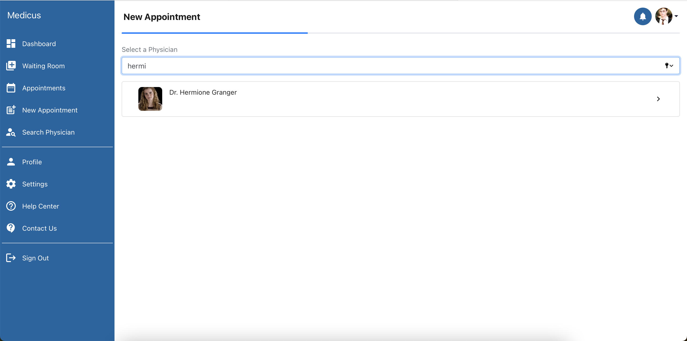
   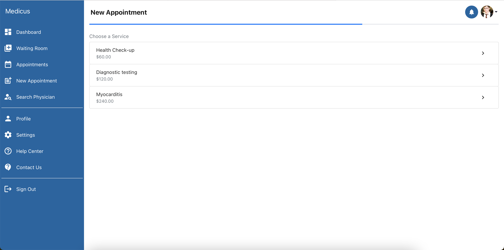
   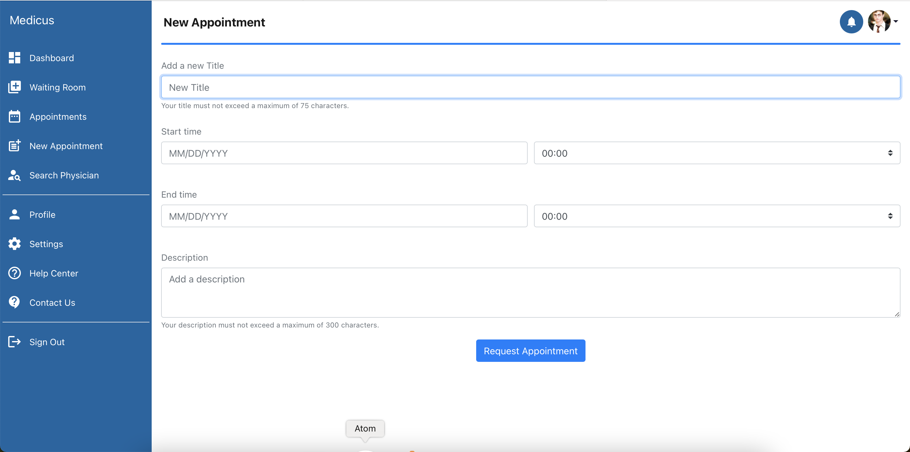
</p>

5. **Appointments** page: Here you can view all the appointments that you've requested for or scheduled with a physician. They are listed in reverse chronological order with latest to earliest. Each appointment provides a quick overview and few options to manage it. You can click on an appointment to go its page.

<p float="left">
   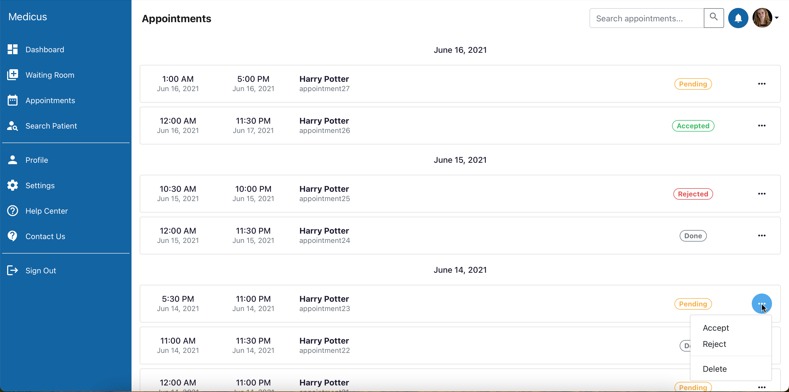
</p>

6. **Appointment** page: You can view your appointment and all it's information in this page. It is further sub-divided into multiple sections.
   1. On the top, a banner provides quick information regarding this appointment. It also includes links to sub sections.
   2. _Information_ section: It provides details information regarding your appointment.
   3. _Medications_ section: It lists are medications suggested by your physician for this appointment. Only a physician can add a new medication.
   4. _Notes_ section: It lists are notes added by your Physician for this appointment. Only a physician can add a new note.
   5. _Reports_ section: Did your physician ask you get a health report? Do you want to attach it to your appointment. Include it here. Both patient and physician can add a new report.
   6. _Payments_ section: Most services provided by your physician may include a service charge. All payments done towards paying this amount are listed here. Only a patient can add a new payment.
   7. Once an appointment has been accepted by the Physician, a chat button is available on the top right corner. You can click on it to be taken to corresponding chat page.

<p float="left">
   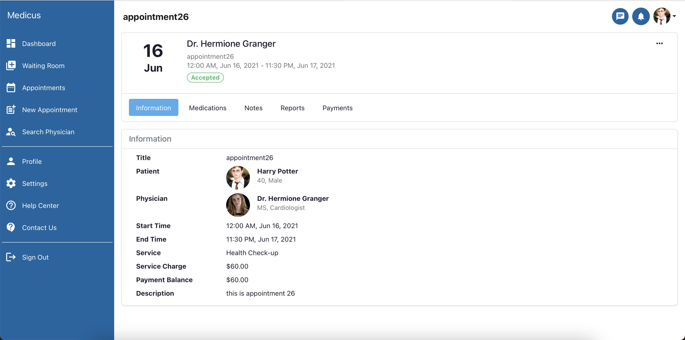
   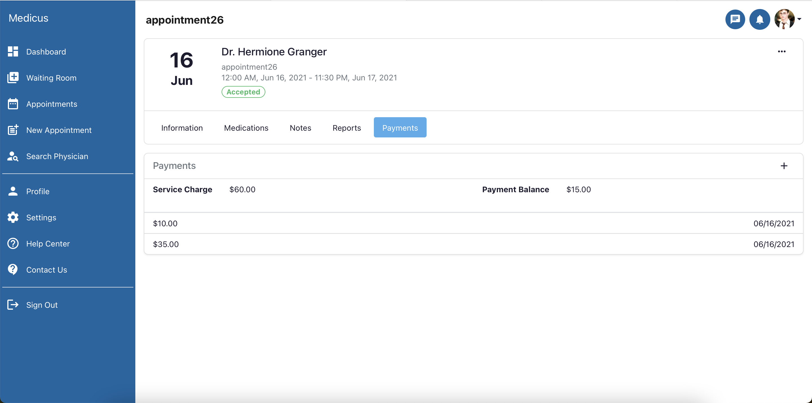
</p>

7. **Chat** page: Each chat page is associated with its appointment page. You can click on "Go to appointment" button on the top right corner to visit this appointment. Once you're on this page, you can chat with your physician and discuss your health issue. All conversations happen at real-time. Take your time to get all the help you will need from your physician.

<p float="left">
   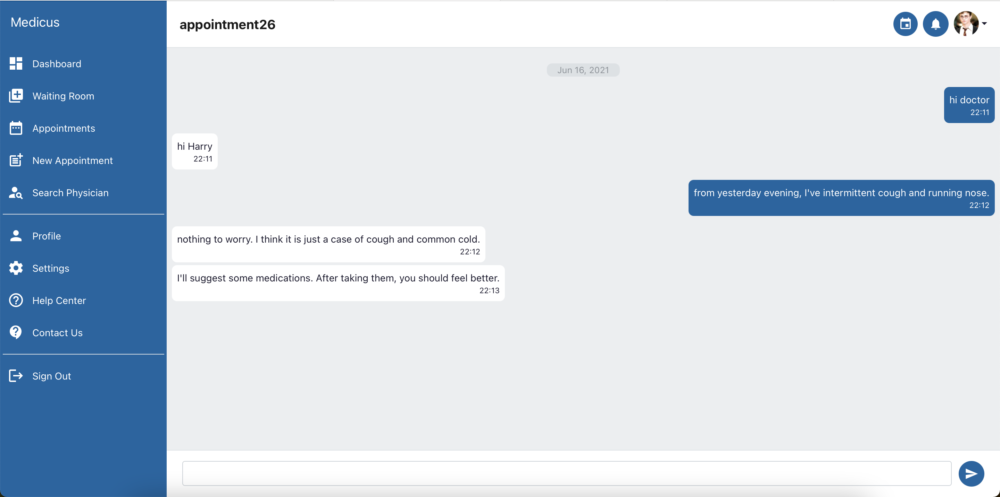
</p>

7. **Waiting Room** page: On the left sidebar, click on "Waiting Room" link. This will take you to your waiting room. Here you can see all appointments that are currently waiting on you to join. It's usually not polite to have others waiting on you. So manage your appointments well.

9. **Search Physician** page [Patients only]: Click on this link in the sidebar to search for a physician who you feel will be best for your health concern. On this page, you can use the search bar at the top to search for a physician using their full name, username or specialization.

10. **Search Patient** page [Patients only]: It is very similar to "Search Physician" page except that physicians can use it to visit their patients' page.

<p float="left">
   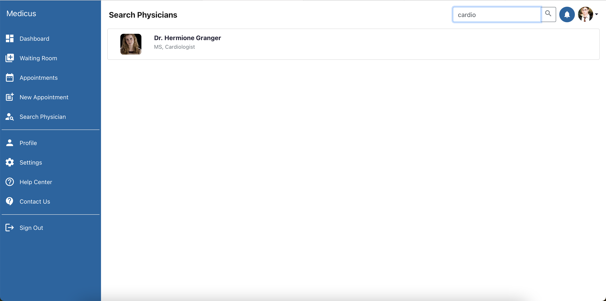
   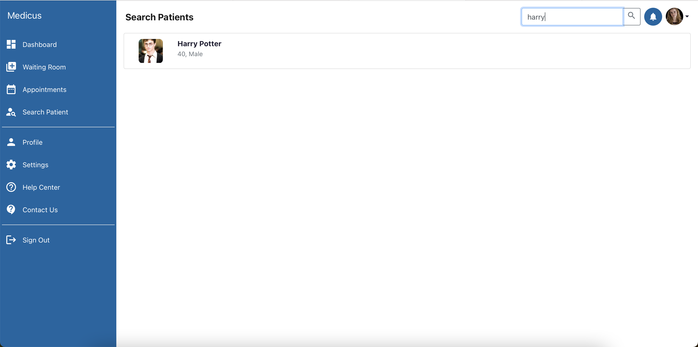
</p>

11. **Profile** page: You can create your profile page and customize it with your details to help a patient/physician who visits it to know you better. What's more? You can add a custom profile picture of yourself too.
    1. On the top, a banner shows your profile picture and includes important details about you.
    2. _About_ section: Add more details about yourself that will highlight you to your patient or physician.
    3. _Medications_ section [Patient Only]: It lists are medications that are currently prescribed to you. It will help your physician to better diagonize you as well as provide you with a more suitable prescription.
    4. _Reports_ section [Patient Only]: It lists are your reports. You can direct your physician to a report that you've already uploaded here.
    5. _Services_ section [Physician Only]: In this section, you can add a services that are provide by you to patients. They can view them before scheduling an appointment.

<p float="left">
   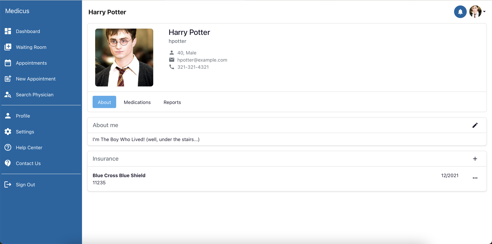
   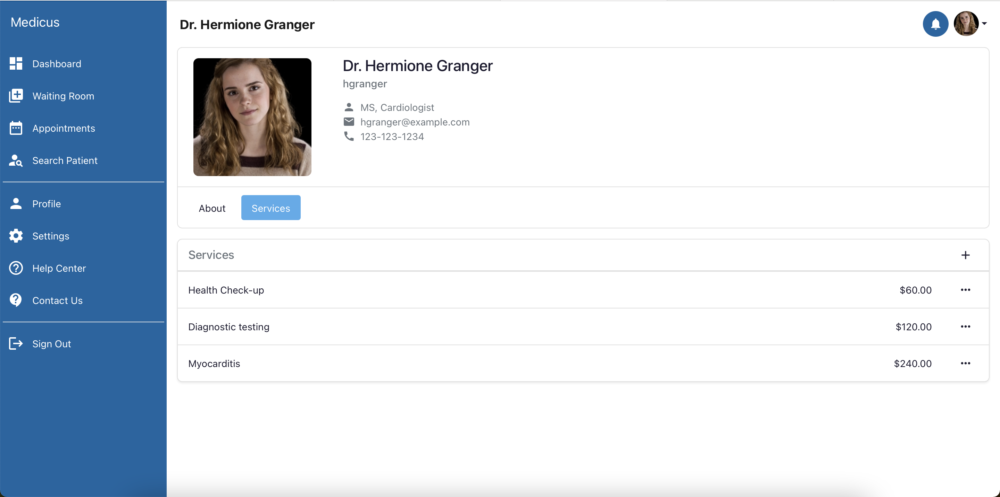
</p>

12. **Settings** Page: You can update personal information in this page. From account information, profile photo, changing password to deleting you account, you can modofy your details here.

14. **Sign Out** link: Clicking on this link in the sidebar will sign you out from the website.

## Try it Out Yourself?
If you wish to download this project and run it locally, you can follow below steps-
1. This project requires npm, Node.js and Express.js to be installed on your machine.
2. You are free to choose a web browser of their choice.
3. Download the project.
4. Go to project's home directory.
5. This project requires a back-end MongoDB database server. If you already have access to it, you can add a .env file in project's home directory and include server details within it.
```
# .env file
DB_SECRET_KEY=<your_db_secret_key>
DB_URI=<your_mongodb_server_uri>
DB_NS=<your_db_namespace>
```
6. Install all dependencies locally.
```
> npm install
```
7. Build React client.
```
> npm run buildClient
```
9. Build Express.js server.
```
> npm run buildServer
```
11. Start medicus server.
```
> npm start
```
12. Connect to website using url- "http://hostname:8000/" where **hostname** is your server's host name.
